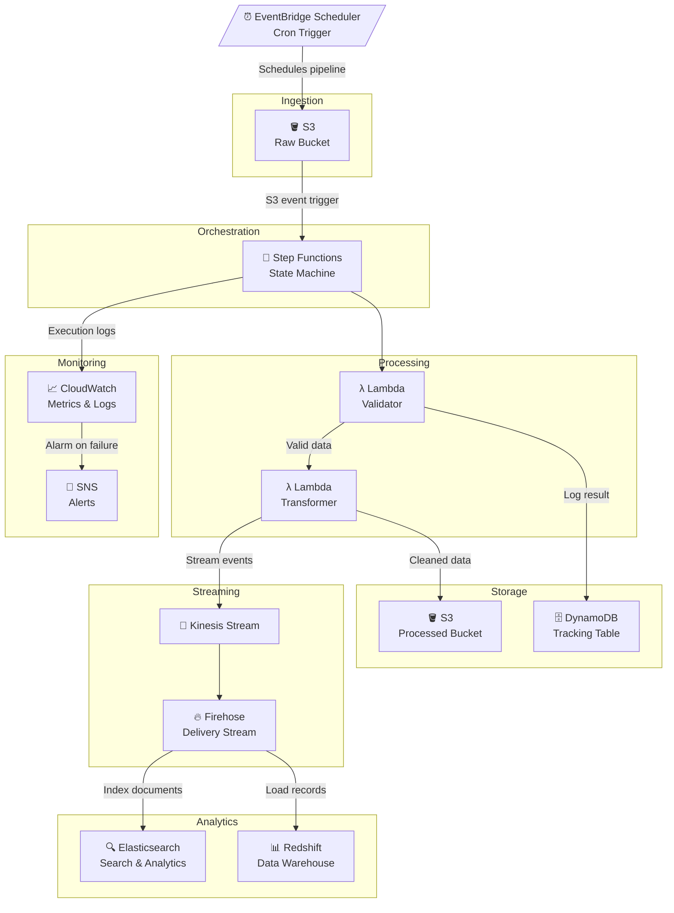
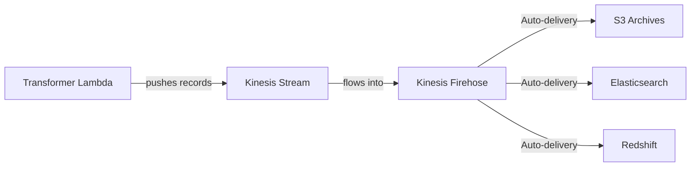

# AWS Data Pipeline — LocalStack Project

A fully AWS-native data pipeline built and tested locally using **LocalStack**, provisioned with **Terraform**, and implemented in **Python**.

---

##  Architecture



---

##  Tech Stack

| Tool | Purpose |
|---|---|
| **LocalStack** | Emulate all AWS services locally |
| **Terraform** | Infrastructure as Code (IaC) |
| **Python** | Lambda functions & data processing |
| **S3** | Raw and processed data storage |
| **Lambda** | Serverless validation & transformation |
| **Step Functions** | Pipeline orchestration (AWS-native) |
| **Kinesis + Firehose** | Real-time data streaming |
| **Elasticsearch** | Search and analytics |
| **Redshift** | Data warehousing |
| **EventBridge Scheduler** | Cron-based pipeline triggers |
| **CloudWatch** | Monitoring and logging |
| **SNS** | Failure alerts and notifications |
| **DynamoDB** | Pipeline run tracking metadata |

---

##  Project Structure

```
AWS-Data-Pipeline/
├── terraform/
│   ├── main.tf              # Provider + LocalStack config
│   ├── s3.tf                # Raw & processed S3 buckets
│   ├── lambda.tf            # Lambda functions
│   ├── step_functions.tf    # State machine definition
│   ├── kinesis.tf           # Kinesis stream + Firehose
│   ├── dynamodb.tf          # Tracking table
│   ├── elasticsearch.tf     # Elasticsearch domain
│   ├── cloudwatch.tf        # Alarms & dashboards
│   ├── sns.tf               # Alert topics
│   └── variables.tf
│
├── lambdas/
│   ├── validator/
│   │   └── handler.py       # Schema & data quality checks
│   └── transformer/
│       └── handler.py       # Data cleaning & enrichment
│
└── scripts/
    └── seed_data.py         # Push sample data for testing
```

---

##  Getting Started

### Prerequisites
- [LocalStack](https://localstack.cloud/) running locally
- [Terraform](https://www.terraform.io/) installed
- Python 3.9+
- AWS CLI configured with LocalStack profile

### Run Locally

```bash
# Start LocalStack
localstack start

# Deploy infrastructure
cd terraform
terraform init
terraform apply

# Seed test data
python scripts/seed_data.py
```

---

##  Deploy to Real AWS

The same Terraform code deploys to real AWS — simply remove the `endpoints` block and `skip_*` flags from `terraform/main.tf` and configure real AWS credentials.